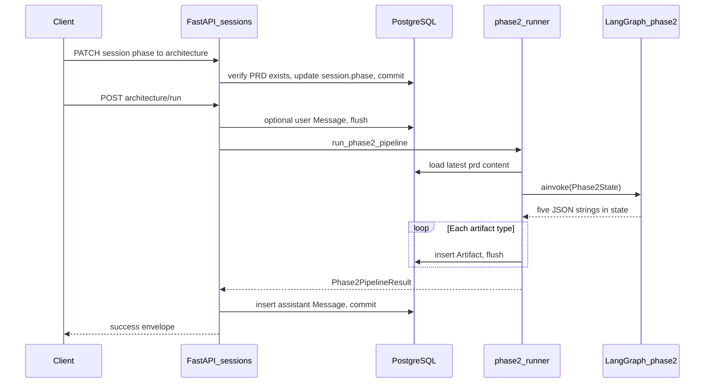
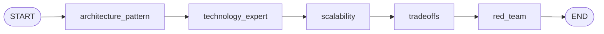

# Phase 2 architecture flow — LangGraph (PRD → five agents)

This document describes **Step 6** of the [Project Execution Guide](../../../../../Project_Execution_Guide.md): how an **approved PRD** (stored as a `prd` artifact) becomes **five versioned architecture artifacts** through a **sequential multi-agent** LangGraph run, and how that maps to code.

**Related:** [System Design Co-Pilot Plan](../../../../../System_Design_CoPilot_Plan.md) (architecture agents §5, workflow §6), [PROJECT_CONTEXT](../../../../../PROJECT_CONTEXT.md), [Phase 1 product flow](./Phase1_Product_LangGraph_Flow.md).

---

## What “agents” mean here

Each agent is **one LangGraph node**: a single LLM call that must return **JSON** validated by a Pydantic model. There is **no separate `app/agents/` package**; behavior lives under **`phase2_architecture/`** (see package [README](../phase2_architecture/README.md)).

| Order | Graph node name | Role (product spec) | Output state key | Persisted `artifact_type` |
|------:|-----------------|---------------------|------------------|---------------------------|
| 1 | `architecture_pattern` | Architecture pattern — structure, decomposition, diagram narrative | `architecture_pattern_json` | `architecture_pattern` |
| 2 | `technology_expert` | Technology expert — stack, data stores, messaging | `architecture_technology_json` | `architecture_technology` |
| 3 | `scalability` | Scalability and performance | `architecture_scalability_json` | `architecture_scalability` |
| 4 | `tradeoffs` | Tradeoff and decision tables | `architecture_tradeoffs_json` | `architecture_tradeoffs` |
| 5 | `red_team` | Red team / critical review | `architecture_red_team_json` | `architecture_red_team` |

Later nodes receive **earlier JSON sections** in the user message so the pipeline stays coherent. Optional **`user_notes`** from the API are included in the PRD context block for every node.

---

## End-to-end flow (HTTP)

1. **Prerequisite:** the session has at least one **`prd`** artifact (from Phase 1 / `synthesize_prd`).

2. Client calls **`PATCH /api/v1/sessions/{session_id}`** with body `{ "phase": "architecture" }`.
   - Fails with **`prd_required`** if no PRD exists.
   - **Idempotent:** if `phase` is already `architecture`, returns success without error.

3. Client calls **`POST /api/v1/sessions/{session_id}/architecture/run`** with optional body `{ "notes": "..." }`.
   - Requires **`phase == "architecture"`** (otherwise **`invalid_phase`**).
   - If **`notes`** is non-empty, a **user** `Message` is stored before the run.
   - **`run_phase2_pipeline`** loads the **latest PRD** by `version`, runs the graph, inserts **five** `Artifact` rows (each type gets `version = max+1` for that session), then stores an **assistant** `Message` with a short summary.

4. Response **`data.architecture_run`** includes **`artifacts`** (id, type, version), assistant message id, and optional user message id.

**Note:** Architecture-phase **`POST .../chat`** does **not** invoke this graph; it remains the **Step 4** single-call chat path. The multi-agent package is **only** produced by **`.../architecture/run`**.

---

## LangGraph topology (one pipeline run)

Compiled in **`apps/api/app/graph/phase2_architecture/build.py`**.

- **Linear only** (no refinement loop in v1). Each node calls **`call_structured_json_node`** (`nodes/llm_node.py`): completion → parse → optional **one** repair turn using **`JSON_REPAIR`** (`prompts/shared.py`) → fallback minimal model if still invalid.

---

## State shape

Defined in **`apps/api/app/graph/state/phase2.py`** as **`Phase2State`**. The runner sets **`prd_content`** from the DB and **`user_notes`** from the request; all five `*_json` keys start empty and are filled as nodes run.

---

## LLM JSON and safety

- **Parsing:** **`parsing/extract.py`** uses Phase 1’s **`extract_json_object`** then **`model_validate_json`** per schema.
- **Schemas:** **`schemas/`** — one module per agent; **`__init__.py`** re-exports.
- **Prompts:** **`prompts/`** — system strings must stay aligned with schema field names.
- **Output hygiene:** fallbacks use **`sanitize_assistant_output`** before embedding raw snippets in minimal JSON.

---

## File map

| Piece | Location |
|--------|-----------|
| Graph state | `apps/api/app/graph/state/phase2.py` |
| Graph compile | `apps/api/app/graph/phase2_architecture/build.py` |
| Node factories | `apps/api/app/graph/phase2_architecture/nodes/*.py` |
| Shared LLM step | `apps/api/app/graph/phase2_architecture/nodes/llm_node.py` |
| Prompts | `apps/api/app/graph/phase2_architecture/prompts/` |
| Pydantic contracts | `apps/api/app/graph/phase2_architecture/schemas/` |
| JSON parsing | `apps/api/app/graph/phase2_architecture/parsing/extract.py` |
| DB + artifact writes | `apps/api/app/services/phase2/runner.py` |
| HTTP | `apps/api/app/routers/architecture_copilot/sessions.py` (`PATCH`, `POST .../architecture/run`) |
| DTOs | `apps/api/app/schemas/architecture_copilot/sessions.py` |

---

## Persistence rules

- **Artifacts:** five rows per successful run, types as in the table above; versioning is **per `(session_id, artifact_type)`**, same pattern as PRD.
- **Messages:** optional user note + assistant summary referencing saved artifact types and versions.

---

## Tests and Postman

- **Unit tests:** `apps/api/tests/unit/test_phase2_graph.py`, `test_phase2_runner.py`. From repo root: `poetry run pytest`.
- **Postman:** `architecture-co-pilot/postman/collections/Architecture-Co-Pilot.postman_collection.json` — PATCH phase + Run architecture pipeline.

---

## Operational note

The pipeline performs **five sequential** OpenAI chat completions in one HTTP request. If you hit timeouts, raise **`LLM_TIMEOUT_SECONDS`** (see `.env.example`).
