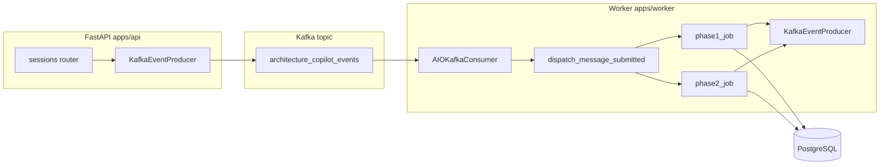

# Kafka in System Design Co-Pilot

This document explains **what Kafka is**, **why this project uses it**, and **how the API and worker implement** the event pipeline (Step 7 in the execution guide).

For a short operational checklist, see [README.md](./README.md) in this folder.

---

## 1. What is Apache Kafka?

**Apache Kafka** is a distributed **event streaming** platform. In this repo it acts as a **message bus** between the FastAPI process and a separate **worker** process.

### Core ideas

| Concept | Meaning |
|--------|---------|
| **Broker** | A Kafka server that stores and serves records. Local dev uses one broker (Docker Compose). |
| **Topic** | A named stream of messages. Producers **append**; consumers **read** with their own progress. |
| **Partition** | Topics are split into partitions for parallelism. Messages with the same **key** go to the same partition, which preserves **order per key**. |
| **Producer** | A client that publishes messages to a topic. |
| **Consumer** | A client that reads messages, usually as part of a **consumer group**. |
| **Consumer group** | A set of consumers that **share** work: each partition is consumed by at most one member at a time. Offsets are committed per group so progress survives restarts. |
| **Offset** | A cursor position in a partition. Committing an offset means “this message and earlier are done.” |

### Delivery semantics (practical view)

Kafka consumers typically use **at-least-once** delivery: a message may be delivered again after a crash or retry. Application code must be **idempotent** (safe to run twice for the same logical job). This project uses a **Postgres deduplication table** for `message.submitted` jobs (see below).

---

## 2. Why Kafka in this project?

The product runs **long-running LangGraph pipelines** (Phase 1 product chat, Phase 2 architecture). Doing all of that inside a single HTTP request ties up the API and hurts timeouts and UX.

**Goals:**

- Return **HTTP 202** quickly when async mode is on, while a **worker** completes the graph and writes to the database.
- **Decouple** API scaling from worker scaling (same codebase today; different processes).
- Emit **observable events** (`agent.run.*`, `artifact.updated`) for logs, future analytics, or additional consumers.

Kafka matches the architecture described in [System_Design_CoPilot_Plan.md](../../../../System_Design_CoPilot_Plan.md) (event-driven flow) and [Project_Execution_Guide.md](../../../../Project_Execution_Guide.md) Step 7.

---

## 3. End-to-end architecture

- **One topic** by default: `architecture_copilot_events` (configurable via `KAFKA_TOPIC_EVENTS`).
- **Message key**: `session_id` (UTF-8 bytes) so events for one session stay ordered in a single partition when the topic has multiple partitions.
- **Library**: [aiokafka](https://github.com/aio-libs/aiokafka) for async producers and consumers in Python.

---

## 4. Configuration (environment)

Shared by API and worker (`app.core.config.Settings`):

| Variable | Role |
|----------|------|
| `KAFKA_BOOTSTRAP_SERVERS` | Broker list (e.g. `localhost:9092` with Compose). |
| `KAFKA_ENABLED` | When true, the API starts `KafkaEventProducer` in lifespan and can publish `session.created` and (with async runs) `message.submitted`. |
| `KAFKA_TOPIC_EVENTS` | Topic name (default `architecture_copilot_events`). |
| `KAFKA_CONSUMER_GROUP` | Worker consumer group id (default `architecture-copilot-worker`). |
| `KAFKA_ASYNC_RUNS` | When true with `KAFKA_ENABLED`, product `POST .../chat` and `POST .../architecture/run` enqueue work and return **202** instead of running the graph in-process. |

The worker also needs `DATABASE_URL`, `OPENAI_API_KEY`, and the same Kafka/topic settings as the API.

---

## 5. Message format: envelopes and event types

All Kafka **values** are UTF-8 JSON **envelopes** validated by Pydantic ([envelope.py](./envelope.py), [serialization.py](./serialization.py)).

Common envelope fields:

- `schema_version`: currently `1`
- `event_type`: discriminator string
- `occurred_at`: UTC timestamp
- `idempotency_key`: string (job deduplication for `message.submitted`; stable key for `session.created`)
- `correlation_id`: UUID (trace one logical run across events)
- `session_id`: UUID
- `payload`: type-specific object

### 5.1 `session.created`

- **Emitted by:** API only ([`app/services/events/publish.py`](../services/events/publish.py)), after `POST /api/v1/sessions` commits, when `KAFKA_ENABLED` is true.
- **Payload:** `SessionCreatedPayload` — `title`, `phase`, `created_at` ([`events/session.py`](./events/session.py)).
- **Idempotency key:** `session.created:{session_id}`.

### 5.2 `message.submitted`

- **Emitted by:** API when `KAFKA_ENABLED` and `KAFKA_ASYNC_RUNS` are true, **before** commit, after the user message is flushed (chat or architecture run).
- **Payload:** `MessageSubmittedPayload` ([`events/messaging.py`](./events/messaging.py)):
  - `run_kind`: `"phase1"` | `"phase2"`
  - `user_message_id`: UUID or null (architecture run may have no notes message)
  - `force_synthesize_prd`: bool (Phase 1 only)
  - `architecture_notes`: optional string (Phase 2)
- **Consumed by:** worker only; other event types on the topic are skipped for processing (but the consumer still commits past them).

### 5.3 `agent.run.started` / `agent.run.completed`

- **Emitted by:** Worker ([`apps/worker/worker_app/kafka_out.py`](../../../worker/worker_app/kafka_out.py)) around each job.
- **Payload:** `AgentRunStartedPayload` / `AgentRunCompletedPayload` — `correlation_id`, `run_kind`, and for completed: `success`, optional `error_summary` ([`events/agent_run.py`](./events/agent_run.py)).

### 5.4 `artifact.updated`

- **Emitted by:** Worker after persisting artifacts (PRD after Phase 1 synthesis; each `architecture_*` row after Phase 2).
- **Payload:** `ArtifactUpdatedPayload` — `artifact_id`, `artifact_type`, `version`, `correlation_id` ([`events/artifact.py`](./events/artifact.py)).

---

## 6. API implementation (`apps/api/app/kafka` and callers)

| Piece | File | Responsibility |
|-------|------|------------------|
| Topic default | [`topics.py`](./topics.py) | Constant aligned with default settings. |
| Contracts | [`envelope.py`](./envelope.py), [`events/`](./events/) | Pydantic models and `DomainEvent` union (discriminated on `event_type`). |
| Serialize / parse | [`serialization.py`](./serialization.py) | `dumps_event`, `loads_event` (used by API producer and worker). |
| Producer | [`producer.py`](./producer.py) | `KafkaEventProducer`: `AIOKafkaProducer` with `enable_idempotence=True`, `send_and_wait`, key = `session_id`. |
| Lifespan | [`app/main.py`](../main.py) | If `kafka_enabled`, start/stop `KafkaEventProducer` on `app.state.kafka_producer`. |
| Publish helpers | [`app/services/events/publish.py`](../services/events/publish.py) | `publish_session_created_if_enabled`, `publish_phase1_enqueued`, `publish_phase2_enqueued`, `new_job_keys`. |
| HTTP behavior | [`app/routers/architecture_copilot/sessions.py`](../routers/architecture_copilot/sessions.py) | Create session → optional `session.created`. Async chat / architecture run → enqueue `message.submitted`, return 202 + `data.queued_agent_run`. **GET** `/api/v1/sessions/{id}/messages` for polling after 202. |
| Idempotency storage | [`app/db/models/__init__.py`](../db/models/__init__.py) `ProcessedKafkaEvent`, migration `20260406_0002_*`, [`app/services/kafka_idempotency.py`](../services/kafka_idempotency.py) | Used by the **worker**, not the API producer. |

**Sync mode** (`KAFKA_ASYNC_RUNS=false`): chat and architecture run behave as before (graph runs in the API process). You can still set `KAFKA_ENABLED=true` to publish `session.created` only.

---

## 7. Worker implementation (`apps/worker`)

The worker is a separate process: `poetry run worker` → [`devtools/run_worker.py`](../../../../devtools/run_worker.py) adds `apps/api` and `apps/worker` to `sys.path`, then runs [`worker_app/main.py`](../../../worker/worker_app/main.py).

| Piece | Path | Responsibility |
|-------|------|----------------|
| Entry | [`apps/worker/worker_app/main.py`](../../../worker/worker_app/main.py) | Load `Settings`, require `DATABASE_URL` and `OPENAI_API_KEY`, build `AsyncOpenAI` + `OpenAILLMProvider`, start **two** Kafka clients: consumer + `KafkaEventProducer` (for telemetry events back to the same topic). |
| Consumer loop | [`events_consumer.py`](../../../worker/worker_app/consumers/events_consumer.py) | `AIOKafkaConsumer` on `kafka_topic_events`, `group_id=kafka_consumer_group`, **`enable_auto_commit=False`**. Poll `getone` with timeout; parse envelope; if `MessageSubmittedEvent`, `dispatch_message_submitted`; **`await consumer.commit()`** after each handled message (or after skipping invalid JSON). On handler exception, **no commit** → at-least-once redelivery. |
| Dispatch | [`dispatch.py`](../../../worker/worker_app/handlers/dispatch.py) | Routes `payload.run_kind` to `process_phase1_job` or `process_phase2_job`. |
| Phase 1 job | [`phase1_job.py`](../../../worker/worker_app/handlers/phase1_job.py) | Claim idempotency row → commit → emit `agent.run.started` → `run_phase1_turn` → assistant `Message` + optional PRD `Artifact` → commit → `agent.run.completed` (success/failure) → optional `artifact.updated` for PRD. On failure, **`release_message_submitted_claim`** so a retry can process again. |
| Phase 2 job | [`phase2_job.py`](../../../worker/worker_app/handlers/phase2_job.py) | Same pattern: claim, started, validate session phase + PRD, `run_phase2_pipeline`, assistant message, five artifacts, completed + one `artifact.updated` per artifact. Invalid session releases claim and emits failed completed event. |
| Outbound events | [`kafka_out.py`](../../../worker/worker_app/kafka_out.py) | Helpers to build and publish `AgentRunStartedEvent`, `AgentRunCompletedEvent`, `ArtifactUpdatedEvent` (fresh idempotency keys for telemetry). |

**Idempotency flow for jobs**

1. `claim_message_submitted_job` inserts into `processed_kafka_events` with `ON CONFLICT DO NOTHING`. If no row inserted, another worker already took the job → **skip** (still commit Kafka offset).
2. **Commit** the claim in its own short DB transaction so the claim survives before long LLM work.
3. On **success**, the claim row stays (prevents duplicate processing).
4. On **failure**, `release_message_submitted_claim` deletes the row so Kafka redelivery can retry.

---

## 8. Local development checklist

1. Start infra: `docker compose up` (Kafka on port `9092` per Compose file).
2. Apply migrations: `poetry run migrate upgrade head` (includes `processed_kafka_events`).
3. Set `.env`: at minimum `KAFKA_ENABLED=true` and, for async HTTP, `KAFKA_ASYNC_RUNS=true`.
4. Terminal A: `poetry run api`
5. Terminal B: `poetry run worker`
6. Call chat or architecture run; if you get **202**, poll `GET /api/v1/sessions/{session_id}/messages` until the assistant message appears.

---

## 9. File index (this package)

| File | Purpose |
|------|---------|
| [KAFKA.md](./KAFKA.md) | This document |
| [README.md](./README.md) | Short topic / event table / dev notes |
| [envelope.py](./envelope.py) | Event envelope models and helpers |
| [serialization.py](./serialization.py) | JSON encode/decode for Kafka payloads |
| [producer.py](./producer.py) | `KafkaEventProducer` |
| [topics.py](./topics.py) | Default topic name constant |
| [events/](./events/) | Payload models per domain |

Worker code lives under **`apps/worker/worker_app/`** and imports **`app.kafka.*`** and **`app.services.*`** from the API tree so contracts stay single-sourced.
