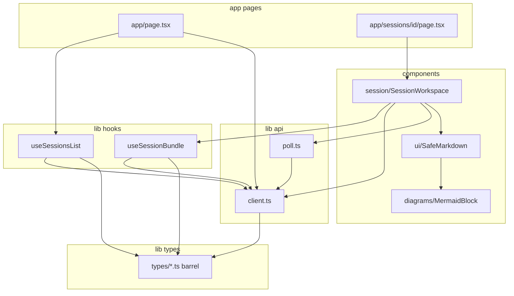

# Frontend context (`apps/web`)

Scope: **Next.js 15 App Router** UI only. Domain logic and persistence live in **FastAPI** (`apps/api`) and the **Kafka worker** (`apps/worker`). This app calls the API over HTTP using the JSON envelopes described in [PROJECT_CONTEXT.md](../../PROJECT_CONTEXT.md).

**Run:** `npm install` → `npm run dev` (default [http://localhost:3000](http://localhost:3000)). Set **`NEXT_PUBLIC_API_URL`** in **`apps/web/.env.local`** (Next does not load the repo-root `.env`). The API must list your dev origin in **`CORS_ORIGINS`**.

---

## How the layers connect

| Layer | Role |
|--------|------|
| **`app/`** | Routes and composition. **`page.tsx` files are thin:** the home page is a client component that uses a hook; the session route renders **`SessionWorkspace`** with the URL `id`. **`layout.tsx`** sets global fonts and metadata. |
| **`components/`** | Presentational and feature UI. **`SessionWorkspace`** owns chat input, phase actions, artifact selection, and coordinates **`refresh()`** after mutations. **`SafeMarkdown`** renders message and artifact text; it delegates fenced **`mermaid`** blocks to **`MermaidBlock`** (client-only `mermaid` import). |
| **`lib/hooks/`** | Reusable **client-side data loading** with React state. **`useSessionsList`** loads `GET /api/v1/sessions` for the home list. **`useSessionBundle`** loads session header, messages, and artifact metadata in parallel and exposes **`refresh()`** for post-mutation reloads (without flipping the initial “full page” loading flag). |
| **`lib/api/client.ts`** | **`fetch` wrapper:** reads **`NEXT_PUBLIC_API_URL`**, parses **`{ data, meta }`** successes and **`{ error, meta }`** failures, throws **`ApiError`**. Exposes typed helpers (`fetchSession`, `postChat`, …). **`normalizeMessagesPayload`** adapts the API’s nested **`data.messages.messages`** shape. |
| **`lib/api/poll.ts`** | **`pollUntilAssistantCountExceeds`:** not a React hook; used when **`POST .../chat`** or **`POST .../architecture/run`** returns **202** (Kafka async). Polls **`GET .../messages`** until the assistant message count increases, then the UI calls **`refresh()`** from **`useSessionBundle`**. |
| **`lib/types/`** | TypeScript mirrors of API payloads (**`SessionRow`**, **`MessageRow`**, artifacts, chat results, envelopes). Imported by **`client.ts`**, hooks, and components so the UI stays aligned with **`/api/v1`**. |

---

## Request flow (mental model)

1. **User opens `/`** → **`useSessionsList`** runs **`fetchSessions()`** → list renders; **New session** calls **`createSession()`** then navigates to **`/sessions/{id}`**.
2. **User opens `/sessions/{id}`** → server **`page.tsx`** passes **`sessionId`** into **`SessionWorkspace`** → **`useSessionBundle(sessionId)`** fetches session + messages + artifacts.
3. **User sends chat** → **`postChat`** → on **200**, **`refresh()`** reloads messages and artifacts; on **202**, **`pollUntilAssistantCountExceeds`** then **`refresh()`**.
4. **User selects an artifact** → **`fetchArtifact(sessionId, artifactId)`** in a local **`useEffect`** inside **`SessionWorkspace`** (detail fetch is scoped to selection, not the bundle hook).
5. **Markdown in chat or artifacts** → **`SafeMarkdown`** (`react-markdown` + **`rehype-sanitize`**) → **`MermaidBlock`** for diagrams.

---

## Related docs

- [PROJECT_CONTEXT.md](../../PROJECT_CONTEXT.md) — API routes, env vars, monorepo layout  
- [DEVELOPER_OPERATIONS.md](../../DEVELOPER_OPERATIONS.md) — run API + web + worker locally  
