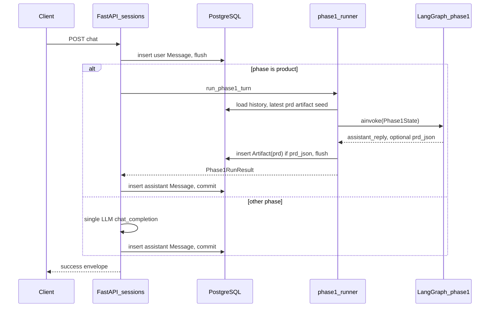
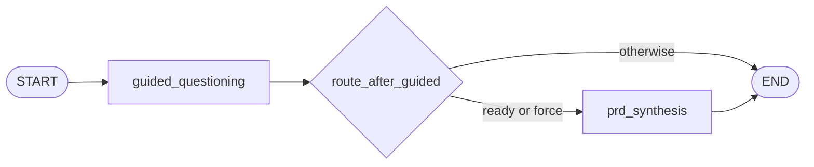

# Phase 1 product flow — LangGraph (idea → PRD)

This document describes **Step 5** of the [Project Execution Guide](../Project_Execution_Guide.md): how a chat message becomes either **guided clarification** or a **versioned PRD artifact**, and how that maps to code.

**Related:** [System Design Co-Pilot Plan](../System_Design_CoPilot_Plan.md) (Guided Questioning §5.6, workflow §6), [PROJECT_CONTEXT](../PROJECT_CONTEXT.md).

---

## End-to-end flow (HTTP)

1. Client calls **`POST /api/v1/sessions/{session_id}/chat`** with JSON body:
   - **`content`** — user message (required).
   - **`product_action`** — optional: `"default"` or `"synthesize_prd"`.

2. The API loads **`DesignSession`**. If **`phase != "product"`**, the handler uses the **legacy Step 4** path: one system prompt + single `chat_completion`, then stores the assistant message.

3. If **`phase == "product"`** (default for new sessions):
   - The user message is **inserted and flushed** so it is visible to the same DB transaction.
   - **`run_phase1_turn`** (see below) runs the LangGraph and may insert a **`prd` artifact**.
   - The assistant text is stored as a **`Message`**, then the transaction **commits**.

4. Response **`data.chat`** includes the usual message ids plus, when a PRD was written on this request:
   - **`prd_artifact_id`**, **`prd_version`**, **`phase1_ready_for_architecture`** (true when a new PRD row was created).

---

## LangGraph topology (one turn)

Compiled in **`apps/api/app/graph/phase1_product/build.py`**.

- **`guided_questioning`** always runs first. It calls the LLM with the **guided questioning** system prompt, expects **JSON** matching **`GuidedQuestioningOutput`** (`schemas.py`), and updates:
  - **`assistant_reply`** — what the user reads if we stop here.
  - **`requirements_draft`** — consolidated text.
  - **`open_questions`**, **`ready_for_prd`**.

- **`route_after_guided`** sends the run to **`prd_synthesis`** if either:
  - **`force_synthesize`** is true (API set it from **`product_action: synthesize_prd`**), or
  - **`ready_for_prd`** is true after the guided node merged into state.

- **`prd_synthesis`** runs only on that branch. It emits **`PRDDocument`** JSON, sets **`prd_json`** (string stored later as an artifact), and replaces **`assistant_reply`** with a short summary for chat.

There is **no checkpointer**: the next request rebuilds state from **`messages`** (and seeds **`requirements_draft`** from the latest **`prd`** artifact if any).

---

## State shape

Defined in **`apps/api/app/graph/state/phase1.py`** as **`Phase1State`** (a `TypedDict`). The runner fills every key before `ainvoke`; nodes return **partial** dicts that LangGraph merges.

---

## LLM JSON and safety

- **Parsing:** **`json_extract.py`** pulls a `{...}` object from raw output (handles markdown fences and surrounding prose).
- **Validation:** Pydantic models in **`schemas.py`**.
- **Repair:** If parsing fails, nodes issue **one** extra completion with **`GUIDED_JSON_REPAIR`** / **`PRD_JSON_REPAIR`** (`prompts.py`).
- **Fallback:** If still invalid, guided mode returns sanitized raw text with **`ready_for_prd: false`**; PRD mode builds a minimal **`PRDDocument`** so a versioned row can still be stored.
- **Output hygiene:** **`sanitize_assistant_output`** (`app/services/llm/guardrails.py`) caps length and strips a few unsafe patterns before persistence.

---

## File map

| Piece | Location |
|--------|-----------|
| Graph state | `apps/api/app/graph/state/phase1.py` |
| Graph compile | `apps/api/app/graph/phase1_product/build.py` |
| Nodes + router fn | `apps/api/app/graph/phase1_product/nodes.py` |
| Prompts | `apps/api/app/graph/phase1_product/prompts.py` |
| Pydantic LLM contracts | `apps/api/app/graph/phase1_product/schemas.py` |
| JSON extraction | `apps/api/app/graph/phase1_product/json_extract.py` |
| DB hydrate + artifact write | `apps/api/app/services/phase1/runner.py` |
| HTTP branch | `apps/api/app/routers/architecture_copilot/sessions.py` |
| Request/response DTOs | `apps/api/app/schemas/architecture_copilot/sessions.py` |

---

## Persistence rules

- **Messages:** every turn appends **user** then **assistant** rows (`messages` table).
- **PRD artifacts:** each successful synthesis inserts **`artifacts`** with **`artifact_type = "prd"`** and **`version = max(previous)+1`** per session (unique on `(session_id, artifact_type, version)`).

---

## Tests and Postman

- **Unit tests** (mock LLM, no network): `apps/api/tests/unit/test_phase1_graph.py`. Run from repo root: `poetry run pytest`.
- **Postman** examples: `architecture-co-pilot/postman/collections/Architecture-Co-Pilot.postman_collection.json` (chat + force PRD).
